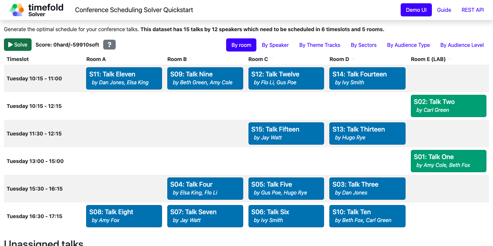

# Conference Scheduling (Java, Quarkus, Maven)

Assign conference talks to timeslots and rooms to produce a better schedule for speakers.



## Constraints

| Name                                  | Level | Description                                                                                |
|---------------------------------------|-------|--------------------------------------------------------------------------------------------|
| Room unavailable timeslot             | Hard  | A talk cannot be scheduled in a room that is unavailable during that timeslot.             |
| Room conflict                         | Hard  | Two talks cannot be scheduled in the same room at the same time.                           |
| Speaker unavailable timeslot          | Hard  | A speaker cannot give a talk during their unavailable timeslot.                            |
| Speaker conflict                      | Hard  | A speaker cannot give two talks simultaneously.                                            |
| Talk prerequisite talks               | Hard  | A talk can only be scheduled after all its prerequisite talks.                             |
| Talk mutually exclusive talks tags    | Hard  | Talks with mutually exclusive tags cannot be scheduled simultaneously.                     |
| Consecutive talks pause               | Hard  | A speaker must have a minimum pause between consecutive talks.                             |
| Crowd control                         | Hard  | Talks that have a crowd control risk must not overlap with too many other high-risk talks. |
| Speaker required timeslot tags        | Hard  | A speaker's required timeslot tags must be present in their assigned timeslot.             |
| Speaker prohibited timeslot tags      | Hard  | A speaker's prohibited timeslot tags must not be present in their assigned timeslot.       |
| Talk required timeslot tags           | Hard  | A talk's required timeslot tags must be present in its assigned timeslot.                  |
| Talk prohibited timeslot tags         | Hard  | A talk's prohibited timeslot tags must not be present in its assigned timeslot.            |
| Speaker required room tags            | Hard  | A speaker's required room tags must be present in their assigned room.                     |
| Speaker prohibited room tags          | Hard  | A speaker's prohibited room tags must not be present in their assigned room.               |
| Talk required room tags               | Hard  | A talk's required room tags must be present in its assigned room.                          |
| Talk prohibited room tags             | Hard  | A talk's prohibited room tags must not be present in its assigned room.                    |
| Theme track conflict                  | Soft  | Talks with the same theme track should not overlap.                                        |
| Theme track room stability            | Soft  | Talks with the same theme track should be held in the same room on the same day.           |
| Sector conflict                       | Soft  | Talks targeting the same sector should not overlap.                                        |
| Audience type diversity               | Soft  | Talks scheduled simultaneously should target different audience types.                     |
| Audience type theme track conflict    | Soft  | Talks with the same audience type and theme should not overlap.                            |
| Audience level diversity              | Soft  | Talks scheduled simultaneously should have different audience levels.                      |
| Content audience level flow violation | Soft  | Talks should be ordered by increasing audience level throughout the day.                   |
| Content conflict                      | Soft  | Talks with the same content should not overlap.                                            |
| Language diversity                    | Soft  | Talks scheduled simultaneously should be in different languages.                           |
| Same day talks                        | Soft  | A speaker's talks should be scheduled on the same day.                                     |
| Popular talks                         | Soft  | Popular talks should be assigned to larger rooms.                                          |
| Speaker preferred timeslot tags       | Soft  | A speaker's preferred timeslot tags should be present in their assigned timeslot.          |
| Speaker undesired timeslot tags       | Soft  | A speaker's undesired timeslot tags should not be present in their assigned timeslot.      |
| Talk preferred timeslot tags          | Soft  | A talk's preferred timeslot tags should be present in its assigned timeslot.               |
| Talk undesired timeslot tags          | Soft  | A talk's undesired timeslot tags should not be present in its assigned timeslot.           |
| Speaker preferred room tags           | Soft  | A speaker's preferred room tags should be present in their assigned room.                  |
| Speaker undesired room tags           | Soft  | A speaker's undesired room tags should not be present in their assigned room.              |
| Talk preferred room tags              | Soft  | A talk's preferred room tags should be present in its assigned room.                       |
| Talk undesired room tags              | Soft  | A talk's undesired room tags should not be present in its assigned room.                   |
| Speaker makespan                      | Soft  | Minimize the scheduling span for each speaker.                                             |

- [Run the application](#run-the-application)
- [Run the packaged application](#run-the-packaged-application)
- [Run the application in a container](#run-the-application-in-a-container)
- [Run it native](#run-it-native)

## Prerequisites

1. Install Java and Maven, for example with [Sdkman](https://sdkman.io):

   ```sh
   $ sdk install java
   $ sdk install maven
   ```

## Run the application

1. Git clone the timefold-quickstarts repo and navigate to this directory:

   ```sh
   $ git clone https://github.com/TimefoldAI/timefold-quickstarts.git
   ...
   $ cd timefold-quickstarts/java/conference-scheduling
   ```

2. (Optional) If you want to run a licensed edition (Plus / Enterprise), set up your license key first. See the [Timefold license tool](https://licenses.timefold.ai/) for instructions.

3. Start the application with Maven:

   1. Community Edition
   
      ```sh
      $ mvn quarkus:dev
      ```
   
   2. Plus / Enterprise Edition: The profile sets up the correct Maven artifacts to run the licensed version. See the `pom.xml` for the implementation details.

      ```sh
      $ mvn quarkus:dev -Denterprise
      ```

4. Visit [http://localhost:8080](http://localhost:8080) in your browser.

5. Click on the **Solve** button.

Then try _live coding_:

- Make some changes in the source code.
- Refresh your browser (F5).

Notice that those changes are immediately in effect.

## Run the packaged application

When you're done iterating in `quarkus:dev` mode, package the application to run as a conventional jar file.

1. Build it with Maven:

   ```sh
   $ mvn package
   ```

2. Run the Maven output:

   ```sh
   $ java -jar ./target/quarkus-app/quarkus-run.jar
   ```

   > **Note**
   > To run it on port 8081 instead, add `-Dquarkus.http.port=8081`.

3. Visit [http://localhost:8080](http://localhost:8080) in your browser.

4. Click on the **Solve** button.

## Run the application in a container

1. Build a container image:

   ```sh
   $ mvn package -Dcontainer
   ```

2. Run a container:

   ```sh
   $ docker run -p 8080:8080 --rm $USER/conference-scheduling:1.0-SNAPSHOT
   ```

## Run it native

To increase startup performance for serverless deployments, build the application as a native executable:

1. [Install GraalVM and gu install the native-image tool](https://quarkus.io/guides/building-native-image#configuring-graalvm).

2. Compile it natively. This takes a few minutes:

   ```sh
   $ mvn package -Dnative
   ```

3. Run the native executable:

   ```sh
   $ ./target/*-runner
   ```

4. Visit [http://localhost:8080](http://localhost:8080) in your browser.

5. Click on the **Solve** button.

## More information

Visit [timefold.ai](https://timefold.ai).
