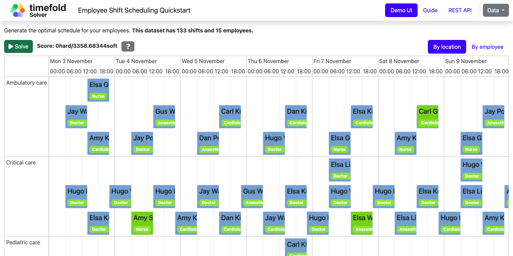

# Employee Scheduling (Java, Quarkus, Maven)

Schedule shifts to employees, accounting for employee availability and shift skill requirements.



## Constraints

| Name                                 | Level | Description                                                                   |
|--------------------------------------|-------|-------------------------------------------------------------------------------|
| Required skill                       | Hard  | An employee must have the required skill for their assigned shift.            |
| No overlapping shifts                | Hard  | An employee cannot be assigned to two overlapping shifts.                     |
| At least 10 hours between two shifts | Hard  | An employee must have at least 10 hours of rest between two shifts.           |
| One shift per day                    | Hard  | An employee can only be assigned to one shift per day.                        |
| Unavailable employee                 | Hard  | An employee cannot be assigned to a shift during their unavailability period. |
| Undesired day for employee           | Soft  | Avoid scheduling an employee on their undesired days.                         |
| Desired day for employee             | Soft  | Prefer scheduling an employee on their desired days.                          |
| Balance employee shift assignments   | Soft  | Fairly distribute shifts across all employees.                                |

- [Run the application](#run-the-application)
- [Run the packaged application](#run-the-packaged-application)
- [Run the application in a container](#run-the-application-in-a-container)
- [Run it native](#run-it-native)

> [!TIP]
>  [Check out our off-the-shelf model for Employee Shift Scheduling](https://app.timefold.ai/models/employee-scheduling/v1). This model supports many additional constraints such as skills, pairing employees, fairness and more.

## Prerequisites

1. Install Java and Maven, for example with [Sdkman](https://sdkman.io):

   ```sh
   $ sdk install java
   $ sdk install maven
   ```

## Run the application

1. Git clone the timefold-quickstarts repo and navigate to this directory:

   ```sh
   $ git clone https://github.com/TimefoldAI/timefold-quickstarts.git
   ...
   $ cd timefold-quickstarts/java/employee-scheduling
   ```

2. (Optional) If you want to run a licensed edition (Plus / Enterprise), set up your license key first. See the [Timefold license tool](https://licenses.timefold.ai/) for instructions.

3. Start the application with Maven:

   1. Community Edition
   
      ```sh
      $ mvn quarkus:dev
      ```
   
   2. Plus / Enterprise Edition: The profile sets up the correct Maven artifacts to run the licensed version. See the `pom.xml` for the implementation details.

      ```sh
      $ mvn quarkus:dev -Denterprise
      ```

4. Visit [http://localhost:8080](http://localhost:8080) in your browser.

5. Click on the **Solve** button.

Then try _live coding_:

- Make some changes in the source code.
- Refresh your browser (F5).

Notice that those changes are immediately in effect.

## Run the packaged application

When you're done iterating in `quarkus:dev` mode, package the application to run as a conventional jar file.

1. Compile it with Maven:

   ```sh
   $ mvn package
   ```

2. Run it:

   ```sh
   $ java -jar ./target/quarkus-app/quarkus-run.jar
   ```

   > **Note**  
   > To run it on port 8081 instead, add `-Dquarkus.http.port=8081`.

3. Visit [http://localhost:8080](http://localhost:8080) in your browser.

4. Click on the **Solve** button.

## Run the application in a container

1. Build a container image:

   ```sh
   $ mvn package -Dcontainer
   ```

2. Run a container:

   ```sh
   $ docker run -p 8080:8080 $USER/employee-scheduling:1.0-SNAPSHOT
   ```

## Run it native

To increase startup performance for serverless deployments, build the application as a native executable:

1. [Install GraalVM and `gu` install the native-image tool](https://quarkus.io/guides/building-native-image#configuring-graalvm).

2. Compile it natively. This takes a few minutes:

   ```sh
   $ mvn package -Dnative -DskipTests
   ```

3. Run the native executable:

   ```sh
   $ ./target/*-runner
   ```

4. Visit [http://localhost:8080](http://localhost:8080) in your browser.

5. Click on the **Solve** button.

## More information

Visit [timefold.ai](https://timefold.ai).
