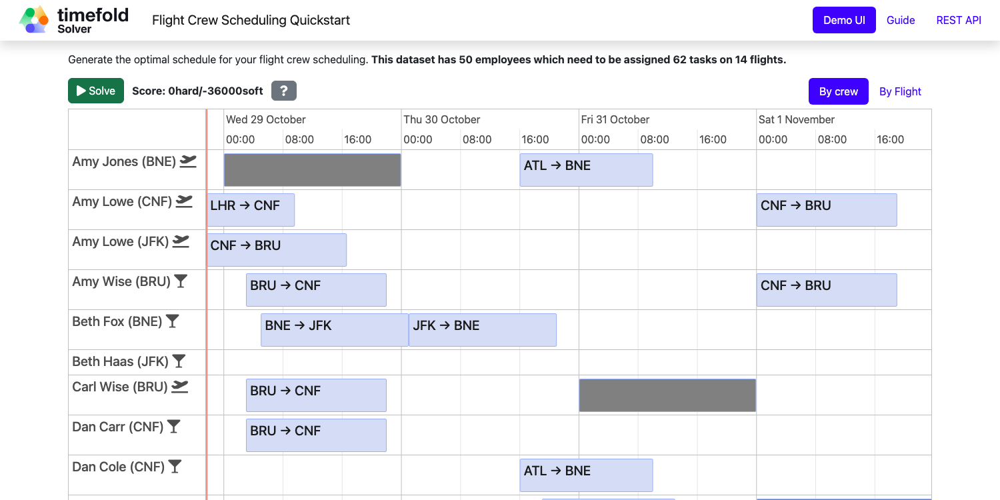

# Flight Crew Scheduling (Java, Quarkus, Maven)

Assign crew to flights to produce a better schedule for flight assignments.



## Constraints

| Name                                     | Level | Description                                                                    |
|------------------------------------------|-------|--------------------------------------------------------------------------------|
| Required skill                           | Hard  | A crew member must have the required skill for their assigned flight.          |
| Flight conflict                          | Hard  | A crew member cannot be assigned to two overlapping flights.                   |
| Transfer between two flights             | Hard  | A crew member must have enough time to transfer between consecutive flights.   |
| Employee unavailability                  | Hard  | A crew member cannot be assigned during their unavailability period.           |
| First assignment not departing from home | Soft  | The first flight assignment should depart from the crew member's home airport. |
| Last assignment not arriving at home     | Soft  | The last flight assignment should arrive at the crew member's home airport.    |

- [Run the application](#run-the-application)
- [Run the packaged application](#run-the-packaged-application)
- [Run the application in a container](#run-the-application-in-a-container)
- [Run it native](#run-it-native)

## Prerequisites

1. Install Java and Maven, for example with [Sdkman](https://sdkman.io):

   ```sh
   $ sdk install java
   $ sdk install maven
   ```

## Run the application

1. Git clone the timefold-quickstarts repo and navigate to this directory:

   ```sh
   $ git clone https://github.com/TimefoldAI/timefold-quickstarts.git
   ...
   $ cd timefold-quickstarts/java/flight-crew-scheduling
   ```

2. (Optional) If you want to run a licensed edition (Plus / Enterprise), set up your license key first. See the [Timefold license tool](https://licenses.timefold.ai/) for instructions.

3. Start the application with Maven:

   1. Community Edition
   
      ```sh
      $ mvn quarkus:dev
      ```
   
   2. Plus / Enterprise Edition: The profile sets up the correct Maven artifacts to run the licensed version. See the `pom.xml` for the implementation details.

      ```sh
      $ mvn quarkus:dev -Denterprise
      ```

4. Visit [http://localhost:8080](http://localhost:8080) in your browser.

5. Click on the **Solve** button.

Then try _live coding_:

- Make some changes in the source code.
- Refresh your browser (F5).

Notice that those changes are immediately in effect.

## Run the packaged application

When you're done iterating in `quarkus:dev` mode, package the application to run as a conventional jar file.

1. Build it with Maven:

   ```sh
   $ mvn package
   ```

2. Run the Maven output:

   ```sh
   $ java -jar ./target/quarkus-app/quarkus-run.jar
   ```

   > **Note**
   > To run it on port 8081 instead, add `-Dquarkus.http.port=8081`.

3. Visit [http://localhost:8080](http://localhost:8080) in your browser.

4. Click on the **Solve** button.

## Run the application in a container

1. Build a container image:

   ```sh
   $ mvn package -Dcontainer
   ```

2. Run a container:

   ```sh
   $ docker run -p 8080:8080 --rm $USER/flight-crew-scheduling:1.0-SNAPSHOT
   ```

## Run it native

To increase startup performance for serverless deployments, build the application as a native executable:

1. [Install GraalVM and gu install the native-image tool](https://quarkus.io/guides/building-native-image#configuring-graalvm).

2. Compile it natively. This takes a few minutes:

   ```sh
   $ mvn package -Dnative
   ```

3. Run the native executable:

   ```sh
   $ ./target/*-runner
   ```

4. Visit [http://localhost:8080](http://localhost:8080) in your browser.

5. Click on the **Solve** button.

## More information

Visit [timefold.ai](https://timefold.ai).
