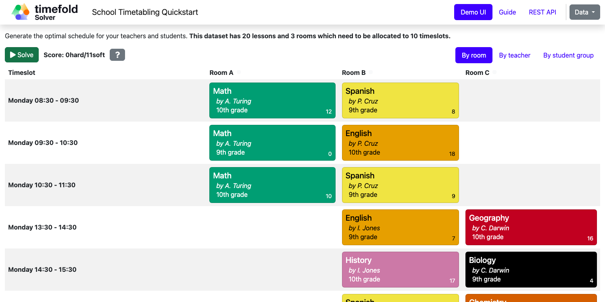

# School Timetabling (Java, Spring Boot, Maven or Gradle)

Assign lessons to timeslots and rooms to produce a better schedule for teachers and students.



## Constraints

| Name                          | Level | Description                                                                   |
|-------------------------------|-------|-------------------------------------------------------------------------------|
| Room conflict                 | Hard  | Two lessons cannot be scheduled in the same room at the same time.            |
| Teacher conflict              | Hard  | A teacher cannot teach two lessons at the same time.                          |
| Student group conflict        | Hard  | A student group cannot attend two lessons at the same time.                   |
| Teacher room stability        | Soft  | A teacher should teach all their lessons in the same room.                    |
| Teacher time efficiency       | Soft  | A teacher should have consecutive lessons to minimize gaps in their schedule. |
| Student group subject variety | Soft  | A student group should not have the same subject in consecutive timeslots.    |

- [Run the application](#run-the-application)
- [Run the packaged application](#run-the-packaged-application)
- [Create a native image](#create-a-native-image)

## Prerequisites

1. Install Java and Maven, for example with [Sdkman](https://sdkman.io):

   ```sh
   $ sdk install java
   $ sdk install maven
   ```

## Run the application

1. Git clone the timefold-quickstarts repo and navigate to this directory:

   ```sh
   $ git clone https://github.com/TimefoldAI/timefold-quickstarts.git
   ...
   $ cd timefold-quickstarts/java/spring-boot-integration
   ```

2. (Optional) If you want to run a licensed edition (Plus / Enterprise), set up your license key first. See the [Timefold license tool](https://licenses.timefold.ai/) for instructions.

3. Start the application with Maven or Gradle:

   1. Community Edition
   
      ```sh
      $ mvn spring-boot:run
      ```

      or with Gradle:

      ```sh
      $ gradle bootRun
      ```
   
   2. Plus / Enterprise Edition: The build configuration sets up the correct dependencies and artifacts to run the licensed version. See `pom.xml` and `build.gradle` for the implementation details.

      ```sh
      $ mvn spring-boot:run -Denterprise
      ```

      or with Gradle:

      ```sh
      $ gradle bootRun -Denterprise=true
      ```

4. Visit [http://localhost:8080](http://localhost:8080) in your browser.

5. Click on the **Solve** button.

## Run the packaged application

When you're ready to deploy the application, package the project to run as a conventional jar file.

1. Build it with Maven:

   ```sh
   $ mvn package
   ```

   or with Gradle:

   ```sh
   $ gradle clean build
   ```

2. Run the Maven output:

   ```sh
   $ java -jar target/spring-boot-integration-1.0-SNAPSHOT.jar
   ```

   or the Gradle output:

   ```sh
   $ java -jar build/libs/spring-boot-integration-1.0-SNAPSHOT.jar
   ```

   > **Note**
   > To run it on port 8081 instead, add `-Dserver.port=8081`.

3. Visit [http://localhost:8080](http://localhost:8080) in your browser.

4. Click on the **Solve** button.

## Create a native image

> **Important:** The solver runs considerably slower in a native image.

If you want faster startup times or need to deploy to an environment without a JVM, you can build a native image.

### Build using Docker

1. Build a Docker image with Maven:

   ```sh
   $ mvn -Pnative spring-boot:build-image
   ```

   or with Gradle:

   ```sh
   $ gradle bootBuildImage
   ```

2. Start the built Docker image using `docker run`:

   ```sh
   $ docker run --rm -p 8080:8080 docker.io/library/spring-boot-integration:1.0-SNAPSHOT
   ```

3. Visit [http://localhost:8080](http://localhost:8080) in your browser.

4. Click on the **Solve** button.

### Build using locally installed GraalVM

1. Build it with Maven:

   ```sh
   $ mvn -Pnative native:compile
   ```

   or with Gradle:

   ```sh
   $ gradle nativeCompile
   ```

2. Run the Maven output:

   ```sh
   $ ./target/spring-boot-integration
   ```

   or the Gradle output:

   ```sh
   $ ./build/native/nativeCompile/spring-boot-integration
   ```

   > **Note**
   > To run it on port 8081 instead, add `-Dserver.port=8081`.

3. Visit [http://localhost:8080](http://localhost:8080) in your browser.

4. Click on the **Solve** button.

## More information

Visit [timefold.ai](https://timefold.ai).
